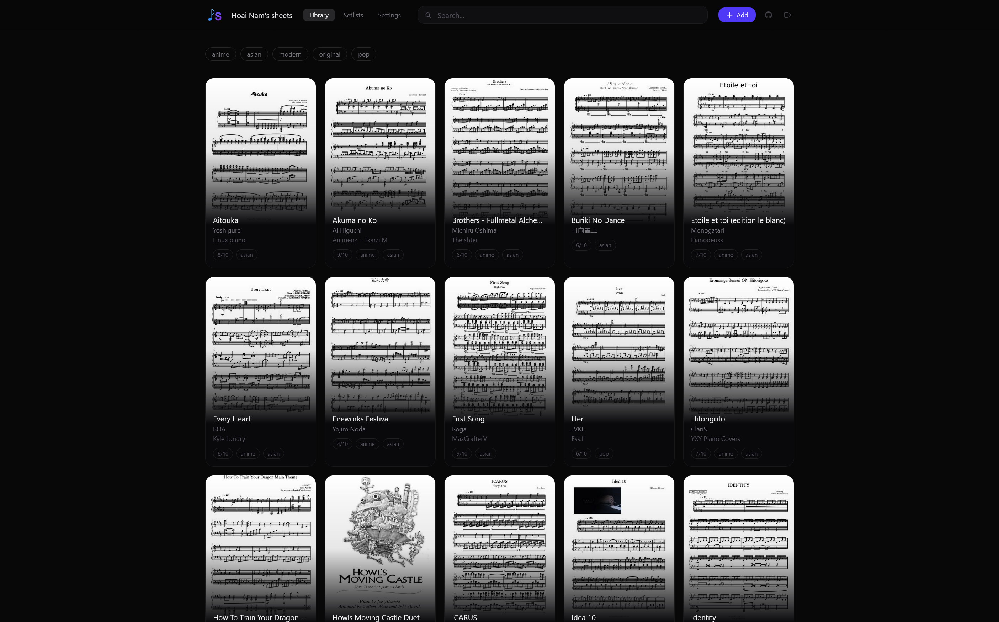

<div align="center">
  
  <h1>ownSheets</h1>
  <p>Your sheet music. One library. Every device.</p>
  <p>
    
    
  </p>
</div>

---

## What is it?

I play piano, and my sheet music lived everywhere: a Downloads folder on my laptop, email attachments on my phone, a USB stick somewhere. Every time I sat down to play, the piece I wanted was on the wrong device.

ownSheets is my fix: a small self-hosted web app where all my PDFs live in one place, tagged and searchable, readable from any device with a browser. I open it on a tablet at the piano, flip pages with arrow keys or a Bluetooth pedal, and never think about where the file actually is.

It runs entirely on free tiers (a static host + a free Supabase project), so it costs nothing to operate. You own the data, the storage, and the deployment.

<div align="center"></div>
<!--  -->

> [!NOTE]
> ownSheets was originally built for personal use and was later open-sourced. AI was used to help write portions of the codebase, but every change was reviewed by myself.

Built with React, TypeScript, Tailwind CSS, PDF.js, and Supabase.

## Features

**The library**
- Upload PDFs and tag them with title, composer, arranger, key, and a 1-10 difficulty
- Cover thumbnails, instant search, and tag filtering
- Setlists: ordered collections of sheets for a session or a gig

**The viewer**
- Full retina-resolution rendering with zoom
- Page turning via arrow keys, spacebar, or any Bluetooth pedal that emulates arrows (AirTurn, PageFlip...)
- Download any sheet straight from the viewer

**Built to be cheap and fast**
- PDFs and thumbnails are cached locally after the first load, so repeat views cost zero Supabase egress and open instantly (the viewer even shows a "cached" badge)
- Loading a thumbnail pre-warms the full PDF cache: by the time you tap a sheet, it is usually already on your device
- Installable as a PWA; the app shell and cached sheets work offline

**Sharing without giving up control**
- You sign in with a single owner password, no account system to manage
- Hand out read-only access codes to friends; revoke them with one click
- Per-code usage stats: devices, downloads, total Supabase egress, last active
- A storage meter shows how much of the free 1 GB you have used

**Your data stays yours**
- One-click backup exports every PDF + all metadata + setlists into a single ZIP
- Import that ZIP into any other ownSheets instance and get an identical library back

## Quick self-hosting

You need [Node.js](https://nodejs.org) 18+, a free [Supabase](https://supabase.com) account, and any static host (I use [Vercel](https://vercel.com)).

```bash
git clone https://github.com/hxpe-dev/ownsheets.git
cd ownsheets
npm install
cp .env.example .env   # fill it in, see Configuration below
npm run dev
```

On the Supabase side (one-time setup, ~5 minutes):

1. Create a new project at [supabase.com](https://supabase.com).
2. Run the entire [`supabase/schema.sql`](supabase/schema.sql) in the SQL Editor. That single file creates every table, policy, function, and the storage bucket.
3. In **Authentication -> Sign in / Providers**: keep **Email** enabled, and enable **Anonymous sign-ins** (that is how guest access codes work).
4. In **Authentication -> Users**: add yourself as a user. That email + password is your owner login.
5. In **Authentication -> URL Configuration**: set the Site URL to wherever you deploy (use `http://localhost:5173` while developing).

To deploy, push the repo to GitHub and import it into Vercel (or Netlify, or Cloudflare Pages). It is a plain Vite app: build command `npm run build`, output `dist/`, plus the environment variables below. Every push redeploys automatically.

<details>
<summary>About the Supabase security advisor warnings</summary>

After running the schema you will see a few remaining warnings. The `auth_allow_anonymous_sign_ins` and `authenticated_security_definer_function_executable` warnings are intentional: anonymous sign-in is how guest access codes work, and guests are `authenticated` users by definition. The `auth_leaked_password_protection` warning requires a Pro plan. Everything else is resolved by the schema's explicit `REVOKE` statements.

</details>

## Configuration

Everything is configured through environment variables (in `.env` locally, or your host's dashboard in production):

| Variable | Required | What it is |
|---|---|---|
| `VITE_SUPABASE_URL` | yes | Your project URL, from Supabase -> Project Settings -> Data API |
| `VITE_SUPABASE_PUBLISHABLE_KEY` | yes | The publishable key, same page |
| `VITE_OWNER_EMAIL` | yes | The email of the owner account you created. The login screen only asks for a password; this fills in the email |
| `VITE_OWNER_NAME` | no | Your name. Turns the tab title and header into "Alice's Sheets" |

### Sharing your library

Go to **Settings**, create an access code, and send it to a friend. They type it on the login screen like a password and get read-only access: view, search, download, nothing else. Each code shows how many devices use it, how much bandwidth they consume, and when they were last active. Revoking a code kicks every device on it instantly.

### Backups

**Settings -> Export backup** downloads a ZIP with every PDF and a `manifest.json` describing all metadata and setlists. **Import backup** on any instance rebuilds the library exactly, with setlist ordering intact. Importing next to existing sheets is safe; nothing gets overwritten.

## Contributing

Issues and PRs are welcome. The codebase is intentionally small: no state management library, no router, just React and a handful of files.

```
src/
├─ routes/      # Library (main shell), Setlists, Settings, Auth
├─ viewer/      # PDFViewer: rendering, zoom, keyboard, pedal
├─ components/  # SheetCard, modals, TagInput, DifficultyPicker
├─ hooks/       # useThumbnail (lazy load + cache)
└─ lib/         # supabase client, queries, auth, pdf cache, backup
supabase/
└─ schema.sql   # the entire database, in one file
```

A few ground rules:

- `supabase/schema.sql` is the single source of truth for the database.
- Run `npm run build` before opening a PR; it type-checks and builds.
- Keep it dependency-light. If a feature needs a 50 kB package, it probably needs a rethink first.

Things I want to build next: per-page annotations, pinning sheets for guaranteed offline use, and audio previews. Pick one up if you are feeling brave :)

---

<div align="center">
  <sub>MIT license, see <a href="LICENSE">LICENSE</a>.</sub>
</div>
